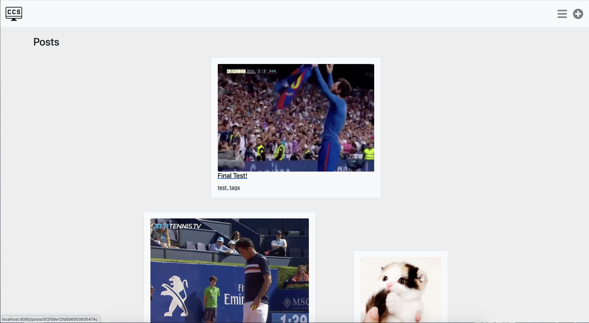
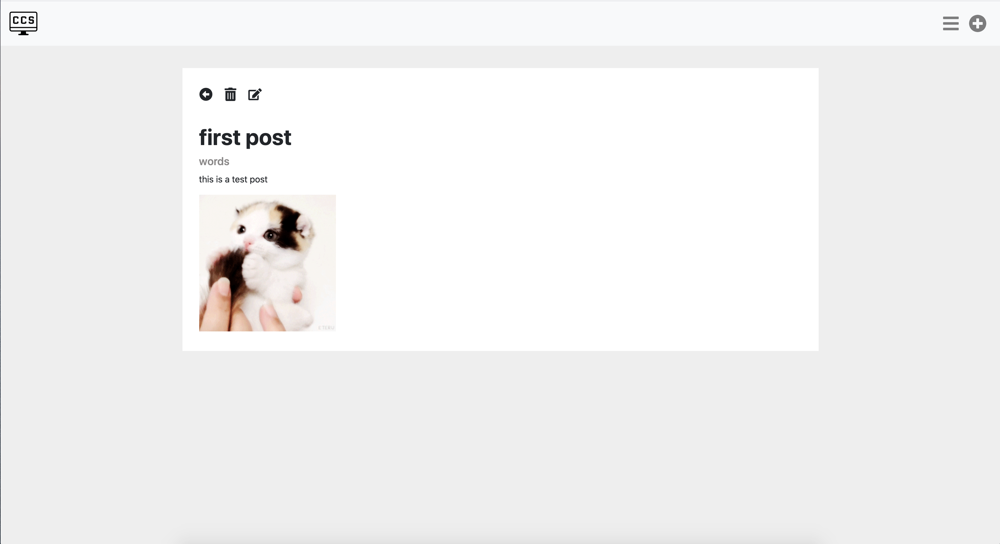
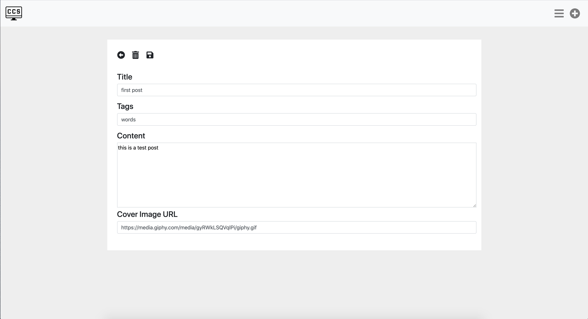
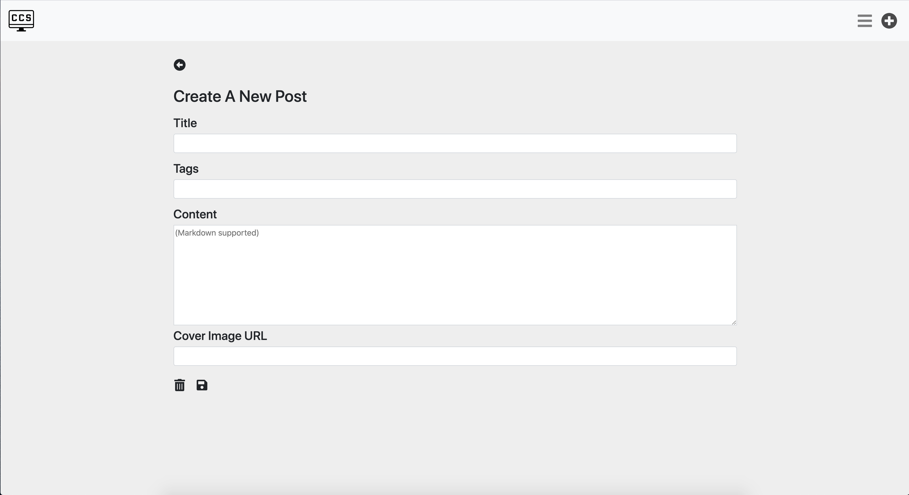

# Lab 4: Redux CRUD Platform Client

In this lab, I built a CRUD blog platform using React, Redux, and React-Router. I used Axios API calls to allow my frontend to communicate with the server. I also made use of an action, reducer, component structure in order to build this blog platform which allows users to view, create, edit, and delete blog posts. 

### SA8
For SA8, I added authentication. Now users are able to sign up, sign in, and sign out. In order to post, edit, and delete, a user must be signed in. Now, each post also shows who it was posted by. 

[deployed url](http://chrissykes-cs52-blog-with-auth.surge.sh/)

## What Worked Well
- I ended up using Bootstrap's NavBar, Card, and Form components, which made life a lot easier. 
- Got a better feel for working with connected components and redux state, as my new-post, post, and posts components were all connected. 
- I didn't use Insomnia, but I did use Postman, which made it much easier to test my API calls.

### SA8
- It was very easy to add the sign up, sign in and sign out buttons, as well as the sign in and sign up forms with bootstrap. 
- I feel more comfortable using heroku and surge to deploy my webpages.

## What Didn't
- I had a last second issue. When I deployed my website, the logo wasn't showing up. I didn't have time to fix it so I just made the title of the page "My Blog". You'll see what the the webpage was supposed to look like with the logo in the screenshots below. 
- It took me a while to get started because I was having a little trouble figuring out how everything worked together. 
- I had an issue with the naming of some of my constant variables that led to issues with bootstrap. 
- I couldn't figure out how to make my font awesome icons bigger in my scss file, so I eneded up having to do some inline css using an IconText component. I couldn't figure out how to make the "New Post" and "All Posts" icons in my NavBar black, with a hover effect that made them gray.  

### SA8
- I had a bit of trouble figuring out how to display the email of the user in the post component. In the end, I ended up storing the email (username) in redux state. 
- Going through and refactoring code to include authentication was a little more tedious than I expected.

## Screenshots
### All Posts

### Individual Post

### Update Post

### New Post

## Extra Credit
None 
